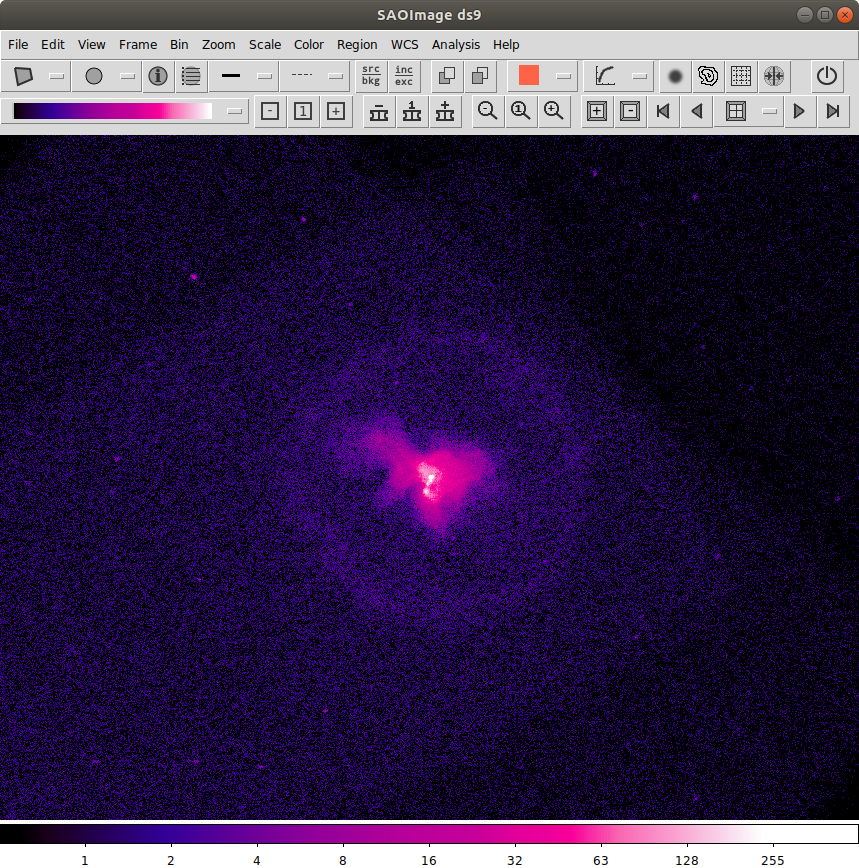
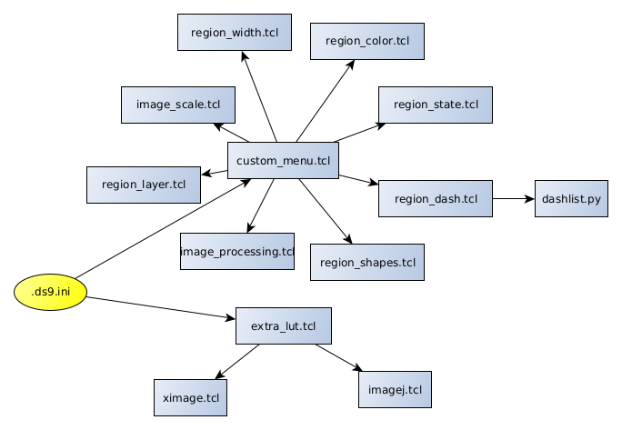
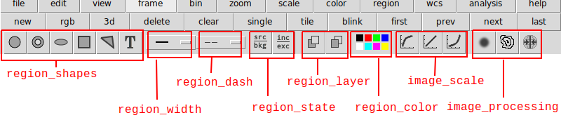

# Customizing SAOImageDS9




The [SAOImage ds9](http://ds9.si.edu) 
application, aka [`ds9`](https://github.com/SAOImageDS9/SAOImageDS9), 
is the premiere image display tool for 
professional and amateur astronomers world wide.

It is a powerful display tool for all common types of astrophysical data
and provides a rich set of features unavailable other packages.

It is also highly flexible and configurable (ie _hackable_) for individual 
users needs.  In fact it was designed and built with that level of 
flexibility in mind.

This repro contains some (only some) of my own personal ds9 hacks. 
It contains code to

1. Generate a new button bar, with icons(!), for access to many common 
   tasks such as changing region shape, color, thickness, dashes, properties.
   It also makes it each to switch image scaling (log, linear, sqrt)
   and provides quick access to smoothing, contours, and frame matching.

2. Includes new color lookup tables adapted from the [ImageJ](https://imagej.nih.gov/ij/)
   and [XImage](https://heasarc.gsfc.nasa.gov/xanadu/ximage/ximage.html)
   projects.  The new colors lookup tables use icons instead of names 
   in the new menus.
   


## Quick start

```bash
cd $HOME

git clone https://github.com/kglotfelty/ds9_hacks/
cd ds9_hacks
ln -s $HOME/ds9_hacks/.ds9.ini ./
```

You can move the `ds9_hacks` directory to whatever location you want; 
you just need to modify the `.ds9.ini` file to point to it.  

```tcl
set ds9_hack_root "$env(HOME)/ds9_hacks"
```

You will also need to modify the `dashes.ans` to point to the new location.


## How does it work?


Under the hood, the `ds9` user interface (GUI) is written in `Tcl/Tk` (pronounced
_tickle tee kay_).  `ds9` was originally developed as a demonstration of a 
set of `Tcl/Tk`  widgets as discussed in
[SAOTk: Tcl/Tk Widgets for Imaging and Data Visualization](http://www.adass.org/adass/proceedings/adass98/joyew/).

It was built on top of a set of modular components and meant to be easily
adaptable.  There are various entry points into the application.  The
one used by this set of hacks is the `.ds9.ini` file.

The `$HOME/.ds9.ini` file is automatically loaded by `ds9` when it starts.  It is
a `Tcl/Tk` script which can do whatever the user desires.  The
version of the script in this repro loads the other scripts to create the various buttons,
loads the new color lookup tables, and adds new analysis tasks.




The buttons are created using a set of `Tcl/Tk` scripts.  Each of the scripts 
creates a set of buttons:




Each of the scripts has comments describing how, in general, it works.  
For specific `ds9` functions, you will need to go diving into the 
`ds9` source code.

The color maps are loaded via the `extra_lut.tcl` script.  That script
includes a modified version of the original `ds9` `load_color_map` routine
which 

- places the new LUTs in their own sub-menu.
- add icons for the color maps 

The _XImage_ and _ImageJ_ LUTs are taken from public domain software package.  
I have many more LUTs in my own personal collection but they require 
different licensing that I'd rather not deal with.


## Versions

These hacks are done at a low level within the code.  As such, they may
not work with each and every version of `ds9`.  They also may break
in unexpected way.  For example, there is a known issue that the
new button bar does not display correctly when the user switches to the
`Vertical Orientation` layout.


## History


At the time, `ds9` was only being developed as a technology demonstration 
application.  

At it's core, `ds9` was built on a highly modular architecture using 
the highly flexible [`Tcl/Tk`](https://www.tcl.tk/), _tickle tee kay_, 
scripting language and GUI.


